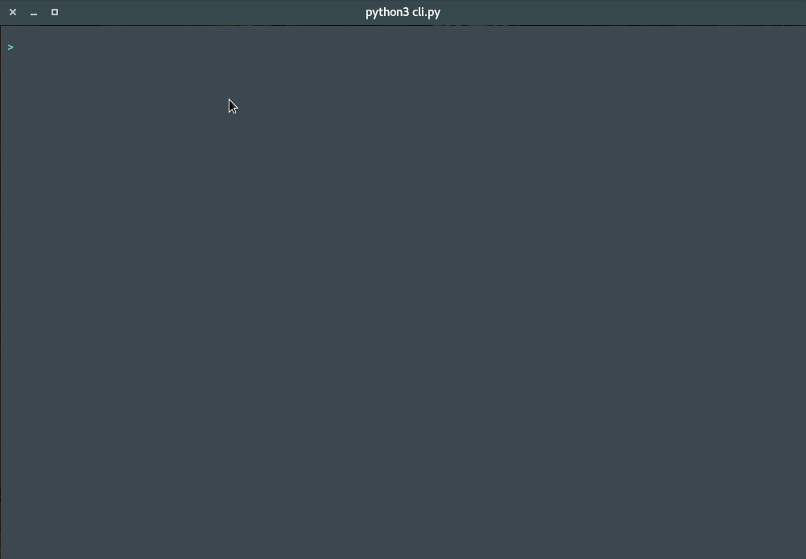

# Oxford CLI
base on python3, a tool used to explain English word meaning, data from en.oxforddictionaries.com

  

## screenshot

## how to start

1. go to [oxford developer](https://developer.oxforddictionaries.com/) to register account , get the `Application ID` && `Application Keys`
2. add `config.py` in `config/`
3. `python3 cli.py`

## keybinding

- `tab` autocompute
- `enter` search
- `q` quit

## TODO

1. add history && bookmark
2. fix content oversize can't display
3. add `oxford_cli` to user command
4. ...
